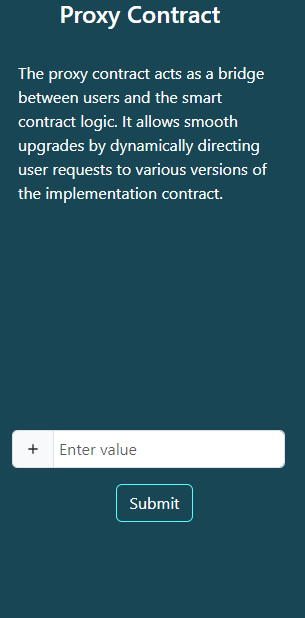
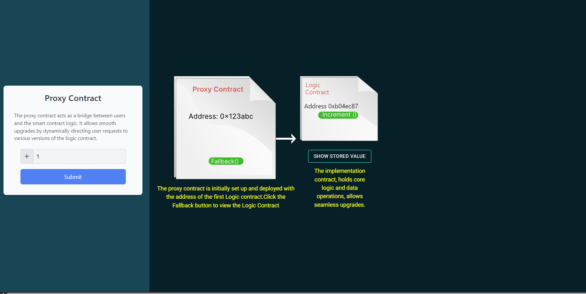
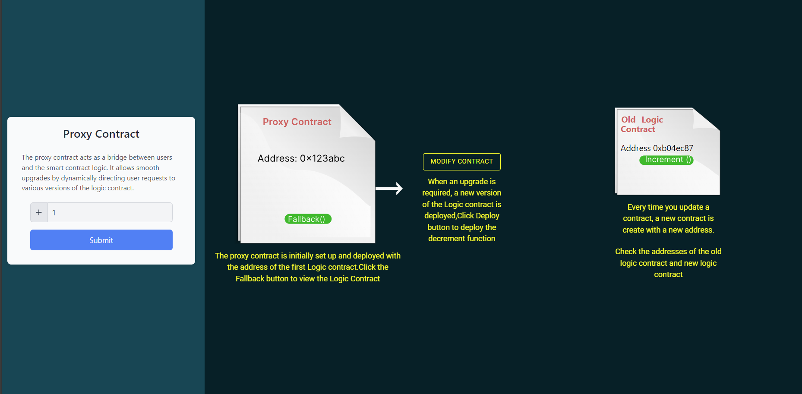
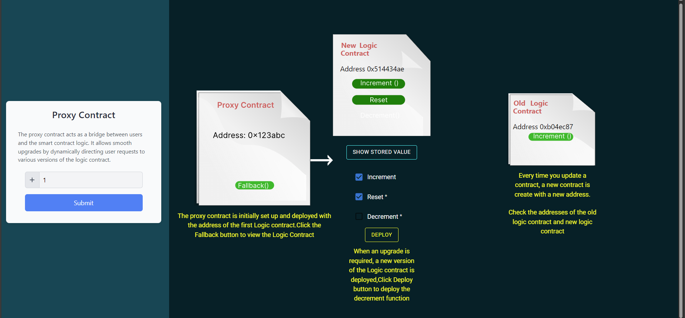
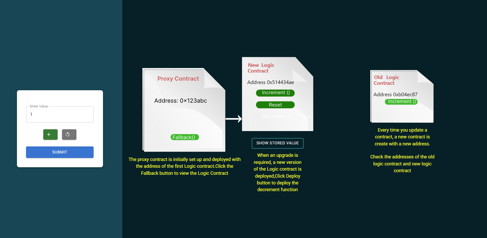
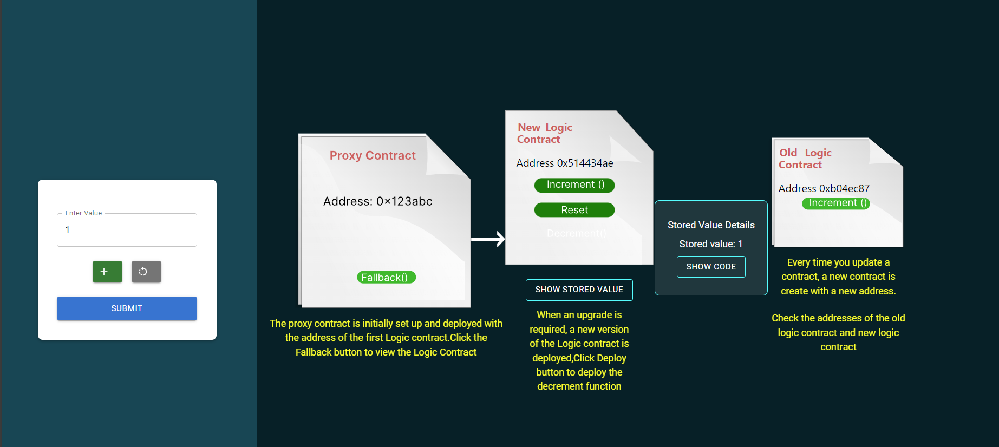

<u><h3>Procedure</h3></u>
 
In this simulation, we will demonstrate Proxy contract approach 

 

To demonstrate the simulation of the proxy contract approach, we will implement the increment-decrement functionality.

1 .Enter values into the input fields and click the submit button to initiate the simulation process.

2. The proxy contract with the address will be displayed,Upon submitting the input, the process starts by initiating the proxy contract with an address and a fallback function.

 The <b>fallback function</b> allows the proxy contract to forward calls and transactions to the logic layer of the target contract, enabling dynamic and upgradeable functionality.

3.Once the fallback function is clicked, the implementation contract and its logic (such as the increment functionality) will be displayed along with stored value button.

4.Click the "Stored Value" button to view the inputted value that has been stored ,the current value of the counter, which is stored in the contract's storage. . Additionally, the "Show Code" button can be used to display the code, providing more detailed information about the implementation.

5.Click on the "Next" button to update the function for decrement. This action will prompt a dialogue box, allowing you to make changes to the functionality associated with different functions.

Click on the "Modify Contract" button to  presents checkboxes for selecting desired features (increment, decrement, reset). Afterward, click on the "Store Value" button to display the current stored value, and finally, click on the "Deploy" button to complete the deployment process.

Click on the "Deploy" button, and a new implementation contract with the selected features is deployed to the blockchain.

The user input will now be updated with the selected functionality integrated into the input user interface.

The application continues to interact with the proxy contract at the same address, unaware of the underlying implementation swap. observe the stored value as it changes with choosen functionality is being inputed by the user 

